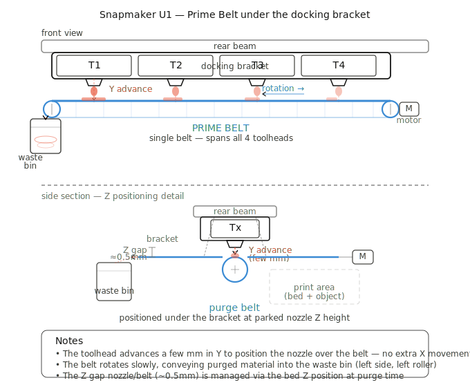
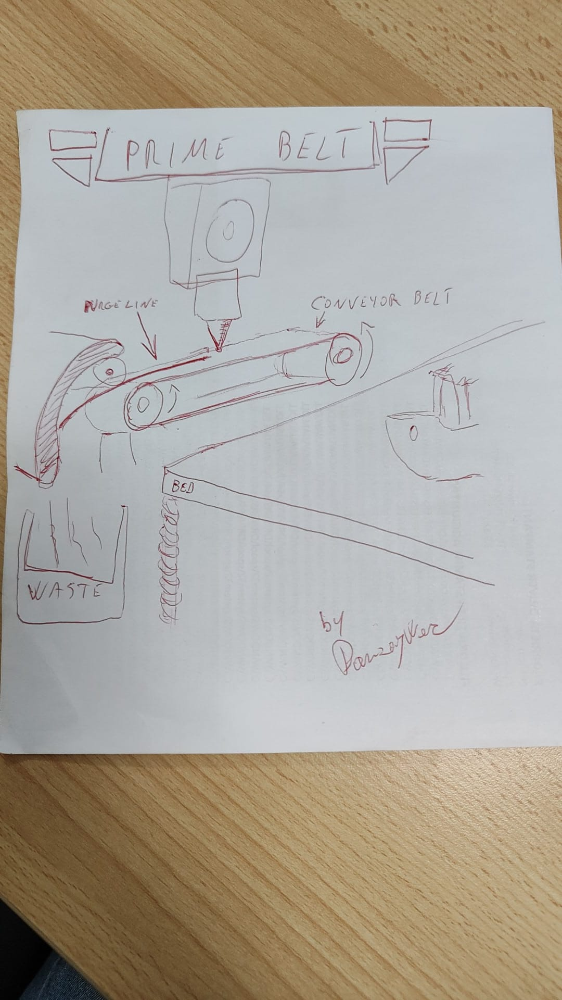

# Prime Belt — Conveyor Purge System for Snapmaker U1

A conveyor belt purge system designed specifically for the Snapmaker U1 tool-changer.
Instead of a purge tower or purge line, a small belt runs under the full width of the
docking bracket — one belt, all 4 nozzles, zero extra travel.

## Concept

Each toolhead already has a fixed park position on the docking bracket.
The Prime Belt sits just below, at nozzle height. To purge, a toolhead
advances a few mm in Y — directly over the belt — deposits the material,
and returns. The belt feeds waste into a removable bin on one side.

**Advantages over purge tower:**
- No bed space wasted
- No extra X movement — purge happens at the park position
- One belt covers all 4 toolheads
- Waste bin removable without opening the machine
- Works with existing Klipper/Fluidd setup

## Concept Diagrams

## Original Sketch

## Status

- [x] Concept design
- [ ] Klipper macro draft
- [ ] CAD / printable mount
- [ ] Physical prototype
- [ ] Testing

## Similar projects

- [Goose Belt Purger](https://github.com/Graylag-PD/Goose-Belt-Purger) — belt purger for Voron CoreXY

## Hardware (planned)

- DC motor GA12-N20, 12V, 15rpm
- Silicone wristband or timing belt (12mm wide)
- 2x 623 bearings
- Printed mount (STL coming soon)

## Klipper integration

See [`klipper/prime_belt.cfg`](klipper/prime_belt.cfg) for macros.
Tested on Snapmaker U1 with firmware extended paxx12.

## License

GPL-3.0 — open source, remixes welcome.
